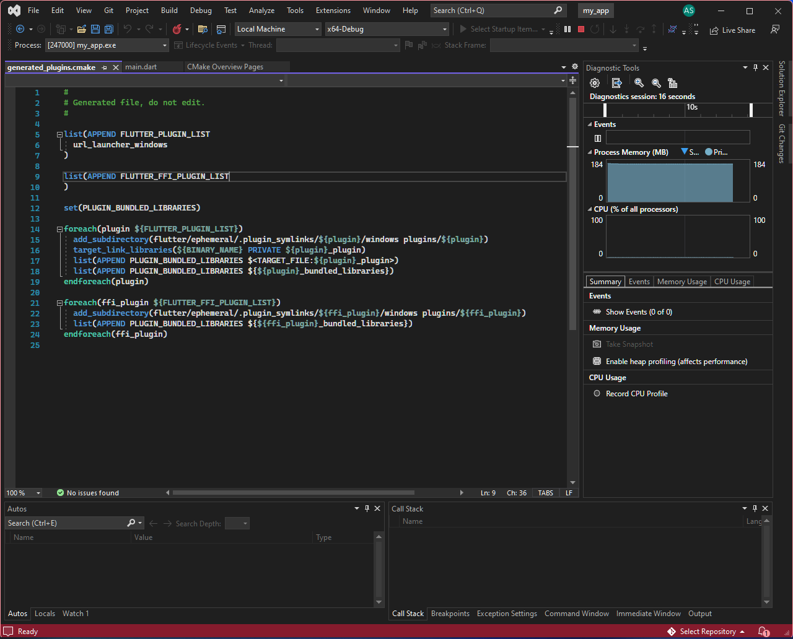

#### PowerShell or Command Prompt

To generate the needed Windows platform dependencies,
run the `flutter build` command.

```terminal
$ flutter build windows --debug
```

#### VS Code

1. Open the `lib/main.dart` file.

1. Click the debug icon
   ().
   This opens the **Debug** pane and launches the app.
   Wait for the app to launch on the device and for the debug pane to
   indicate **Connected**.
   The debugger takes longer to launch the first time.
   Subsequent launches start faster.

   This Flutter app contains two buttons and one link:

   - **Launch in browser**: This button opens this page in the
     default browser of your device.
   - **Launch in app**: This button opens this page within your app.
   - **Flutter.dev**: This link opens https://flutter.dev within your app.

     {:width="50%"}
     <div markdown="1">
     Flutter app showing two buttons to open flutter.dev in a browser or within the app.
     </div>

#### Visual Studio

1. From the **Debug** menu, select **Attach to Process**.
   You can also press <kbd>Control</kbd> + <kbd>Alt</kbd> + <kbd>P</kbd>.
1. From the **Attach to Process** dialog box, choose `my_app.exe`.

   {:width="100%"}

   Visual Studio starts monitoring the Flutter app.

   